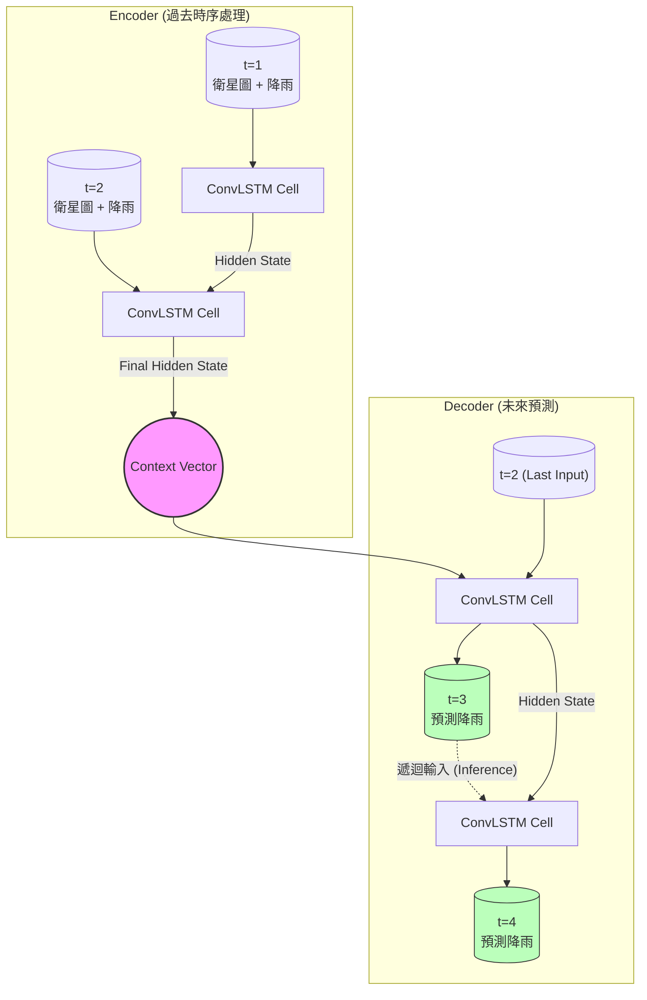
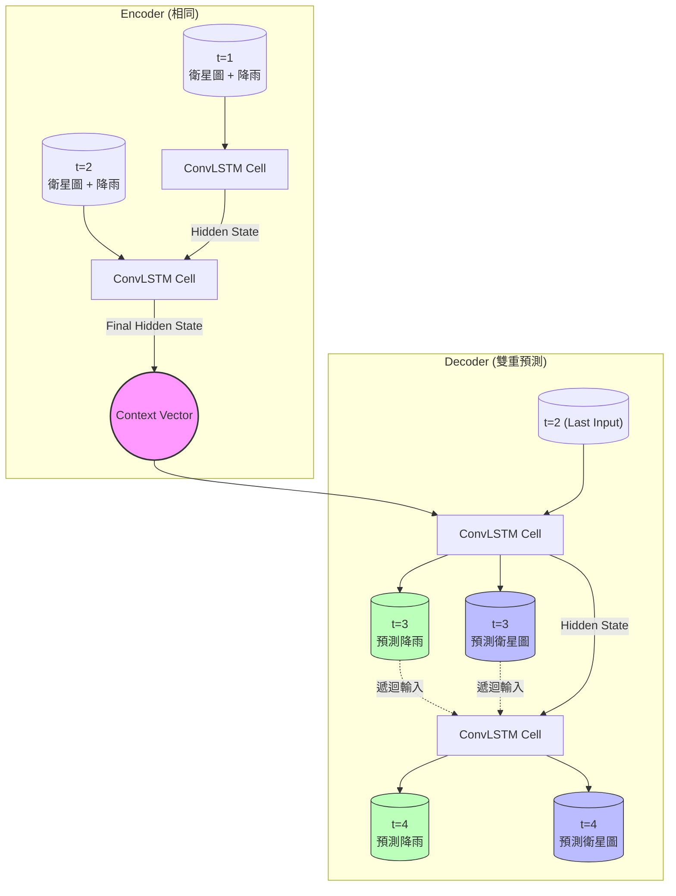

# 模型架構與運算流程說明 (Model Architecture & Flow)

本文件詳細說明 **Implicit (隱式)** 與 **Explicit (顯式)** 兩種 Seq2Seq ConvLSTM 模型的運算流程與差異。

---

## 1. 隱式遞迴模型 (Implicit Seq2Seq)

**核心概念**：
*   模型專注於預測「降雨」。
*   對於未來的「雲層變化 (衛星雲圖)」，模型**不進行顯式預測**。
*   雲層的動態變化被「隱含」在 ConvLSTM 的 Hidden State (記憶體) 中傳遞。

**運算流程**：
1.  **Encoder**: 讀取過去 $N$ 小時的 `[衛星雲圖 + 降雨網格]`，壓縮成一個高維的 Hidden State。
2.  **Decoder**: 
    *   接收 Encoder 的 Hidden State 作為初始狀態。
    *   逐步預測未來的降雨。
    *   **輸入 (Input)**: 上一步的降雨預測 (或是 Ground Truth)。
    *   **輸出 (Output)**: 下一步的降雨預測。

### 流程圖 (Mermaid)

---

## 2. 顯式/混合模型 (Explicit Seq2Seq)

**核心概念**：
*   模型同時預測「降雨」**與**「衛星雲圖」。
*   **強迫模型學會雲的移動**：透過 Loss Function 強制模型畫出未來的雲圖，確保模型真的理解物理現象，而不只是死記降雨數值。
*   **混合遞迴**：Decoder 的下一個輸入，包含了「預測的降雨」與「預測的雲圖」。

**運算流程**：
1.  **Encoder**: 與 Implicit 相同，讀取過去資訊並壓縮。
2.  **Decoder**:
    *   **輸入 (Input)**: 上一步的 `[預測衛星圖 + 預測降雨]`。
    *   **輸出 (Output)**: 下一步的 `[預測衛星圖 + 預測降雨]`。
    *   **Loss 計算**: 同時計算 `Rain_MSE` 和 `Sat_MSE`。

### 流程圖 (Mermaid)

---

## 3. 兩者比較 (Comparison)

| 特徵 | Implicit (隱式) | Explicit (顯式) |
| :--- | :--- | :--- |
| **預測目標** | 僅降雨 | 降雨 + 衛星雲圖 |
| **Decoder 輸入** | 僅降雨資訊 (或依賴 Hidden State) | 降雨 + 衛星雲圖 (完整狀態) |
| **優點** | 計算量較小，專注於降雨 Loss | 可解釋性高 (看得到預測的雲)，物理一致性較好 |
| **缺點** | 無法視覺化未來的雲層變化 | 計算量較大，若雲圖預測失敗可能干擾降雨預測 |
| **適用場景** | 純粹追求降雨數值準確度 | 需要分析雲層移動路徑，或資料量少需 Regularization 時 |
